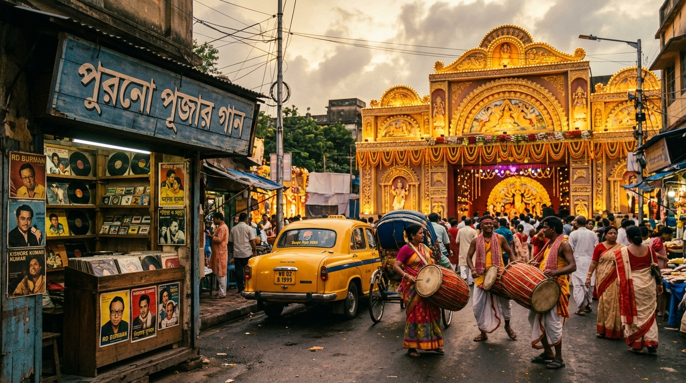
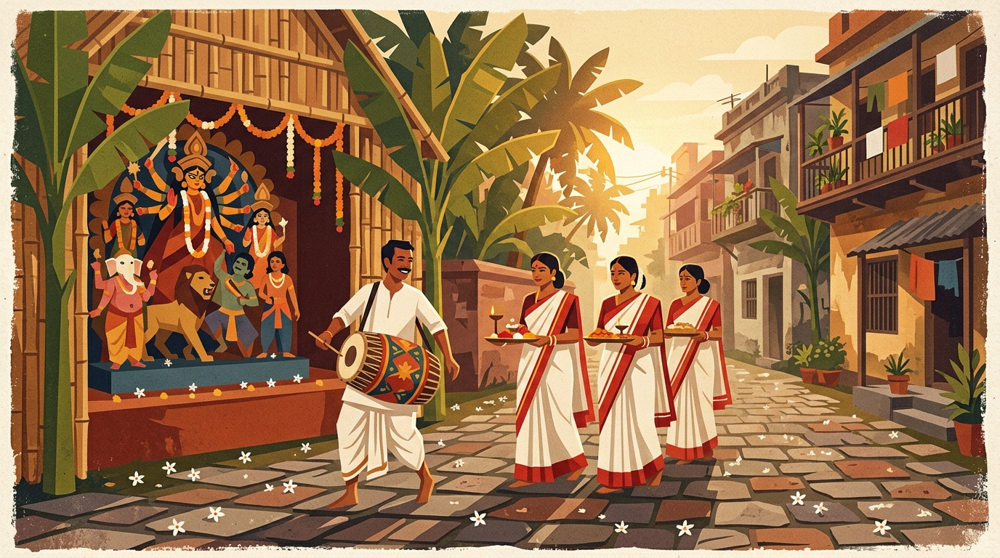
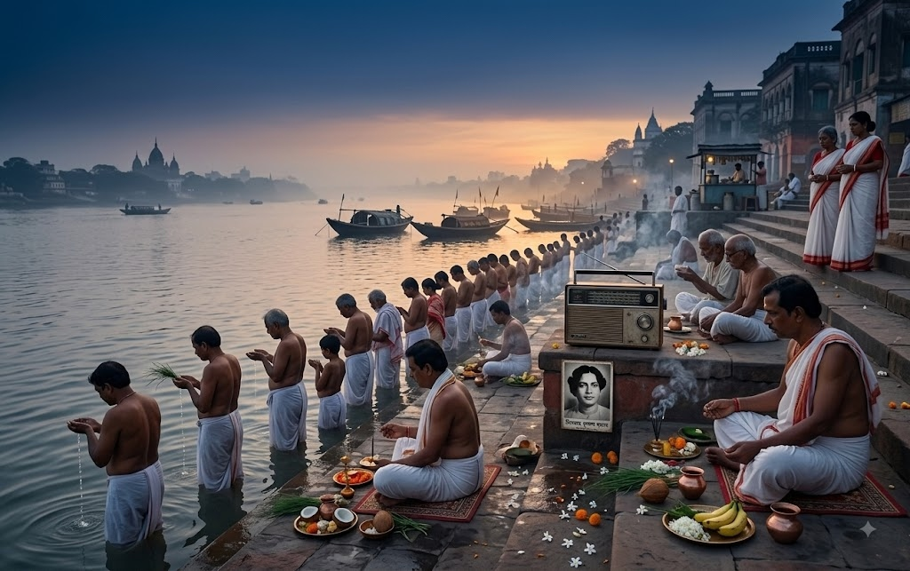
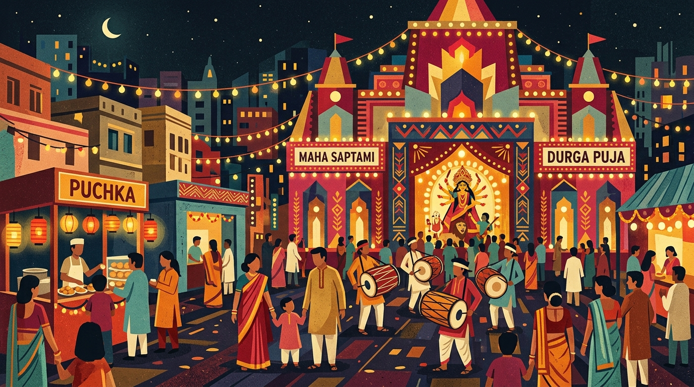
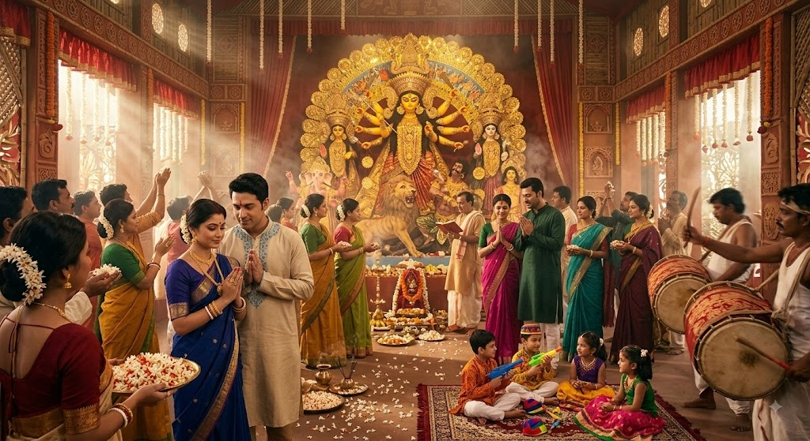
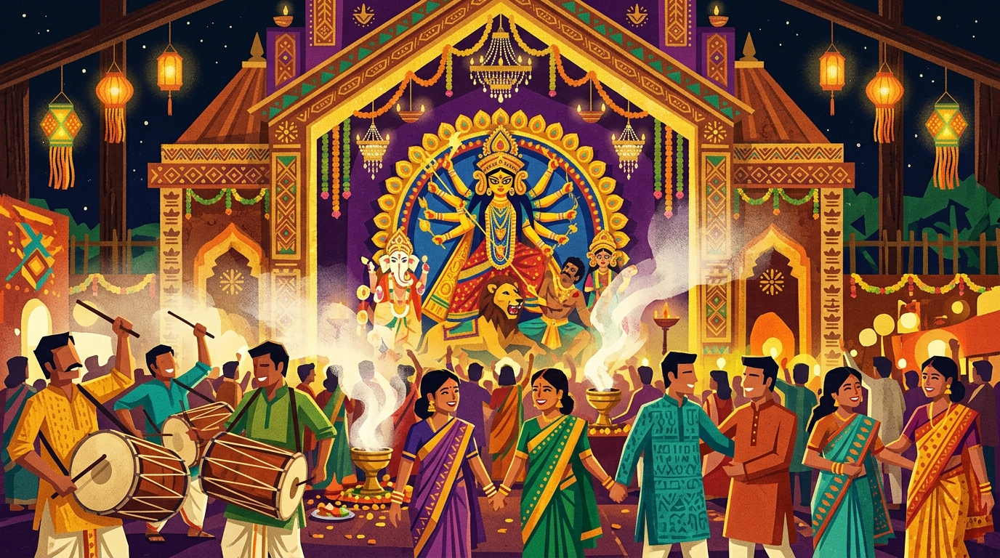
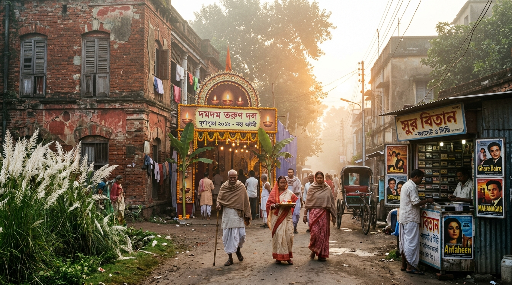
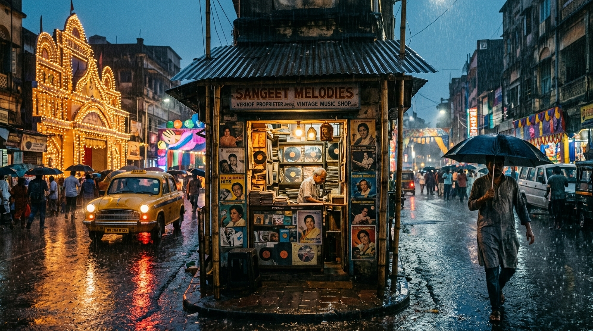
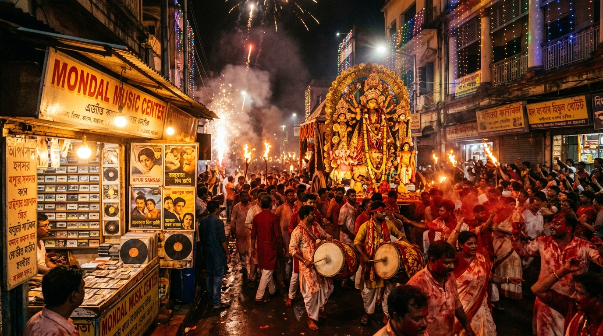
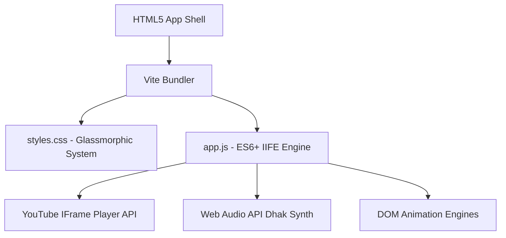

<div align="center">

# 🪔 দুর্গা পূজার গান — Old Durga Puja Songs Archive
### *A Retro-Modern Nostalgic Bengali Festival Audio Experience*


<p align="center">
  <strong>মহালয়ার কাকভোর থেকে বিজয়ার সিঁদুর খেলা — রেডিওর সুর, ক্যাসেটের নস্টালজিয়া আর অমলিন পূজার গান।</strong>
</p>

[**🌐 Live Demo**](https://github.com/Codexia-afk/Trend-On-Durga-pujo) • [**✨ Features**](#-key-features) • [**🖼️ Visual Gallery**](#%EF%B8%8F-photorealistic-theme-gallery) • [**🚀 Quick Start**](#-quick-start)

---

### 🌟 Featured Theme Backdrop: Evening Aarti (সন্ধ্যা আরতি)


</div>

---

## 🎨 Photorealistic Theme Gallery

Explore **9 hand-crafted contemporary Bengali editorial illustration backdrops** capturing every sacred moment of Sharodotsav:

| 🌅 ষষ্ঠীর সকাল (Shasthi Morning) | 🪔 মহালয়ার তর্পণ (Mahalaya Dawn) |
| :---: | :---: |
|  |  |

| 🏮 সপ্তমীর রাতে মণ্ডপ (Saptami Night) | 🌸 অষ্টমীর অঞ্জলি (Ashtami Anjali) |
| :---: | :---: |
|  |  |

| 🌺 নবমীর আরতি (Navami Night) | 🌅 ভোরের মহাষ্টমী (Maha Ashtami Dawn) |
| :---: | :---: |
|  |  |

| 🌧️ বৃষ্টির সন্ধিপূজা (Rainy Sandhi Puja) | ⛵ বিসর্জনের রাত (Visarjan Night) |
| :---: | :---: |
|  |  |

---

## ✨ Key Features & Experience Modules

### 📻 1. Three Curated Playlist Eras (৩টি বিশেষ পূজার প্লে-লিস্ট)
- **নস্টালজিয়া (Nostalgia Hits)**: Timeless classics from Kishore Kumar, Asha Bhosle, and Mita Chatterjee (*Sei Raate Raat Chhilo, Nayan Sarasi, Katha Dilam*).
- **মহিষাসুরমর্দিনী (Mahishasura Mardini)**: The original Birendra Krishna Bhadra Mahalaya dawn broadcast & *Aigiri Nandini* Stotram.
- **বর্তমান যুগ (Present Era)**: Modern hit anthems from Zee Music Bangla (*q-G7GlrGRKU*), Monali Thakur (*Dugga Elo*), Arijit Singh (*Dugga Ma*), Sunidhi Chauhan (*Bolo Dugga Elo*), Anupam Roy, Rupam Islam, Ankita Bhattacharya, and Pritam.

---

### ⏰ 2. Dynamic Live Clock & Hover Countdown Widget
- **Default View**: Displays live clock in English (`⏰ 08:30:14 PM`) across both Bengali & English modes.
- **Interactive Expansion**: Hovering over the top clock pill smoothly expands to show the live **Durga Puja 2026 Countdown** in pure Bengali digits (`🪔 পূজো আসতে বাকি: ৫৯ দিন ০৬ ঘণ্টা ১০ মি`) or English (`🪔 Puja Countdown: 59 Days 06 Hours 10 Mins`).

---

### 🌸 3. Festive Magic Animation Engine (`🌸 উৎসবের আনন্দ`)
- **Enlarged Shiuli Flower Rain**: Crisp 42px SVG 5-petal white flowers with vibrant saffron cores (`#FF5500`), soft drop-shadow filters, and scale boost raining down gently across the viewport.
- **Realistic Kaash Phool Corner Bushes**: Feathery pampas grass stalks growing up from both bottom corners (`#kaash-left-bush` & `#kaash-right-bush`), wind-swaying over the player dock with smooth CSS keyframe physics (`@keyframes swayWind`).
- **Zero Audio Interruption**: Toggling or running the 30-second festive magic experience never interrupts, reloads, or pauses ongoing music playback.

---

### 🥁 4. Interactive Dhak Rhythm Player (`🥁 ঢাকের আওয়াজ`)
- Dedicated Dhak toggle pill playing authentic traditional rhythm (`ZpUOgCsPgy0`) with auto-unmute and volume boost.
- Includes a 60-second auto-off timer and Web Audio API synthesizer drum/bell fallback for offline capability.

---

### 🏺 5. Sabeki Glassmorphic UI & Nostalgic Memory Ticker
- **Terracotta & Gold Palette**: Inspired by Bengal's terracotta temples, brass lamps, and traditional Rajbari architecture.
- **Rotating Memories**: Rotating nostalgic Bengali & English thoughts every 6 seconds celebrating childhood memories, cassetted tapes, and pandal hopping.

---

## 🛠️ Technology Stack & Architecture



- **Frontend**: HTML5, Vanilla CSS3 (Custom Glassmorphic Tokens, Container Queries, Flexbox/Grid)
- **Logic & State**: JavaScript (Modular ES6+ IIFE Architecture)
- **Audio Decoding**: Off-screen YouTube IFrame Player API (`ytPlayer`) + Web Audio API Synthesis
- **Typography**: Google Fonts (`Noto Serif Bengali`, `Galada`, `Cinzel`)
- **Build Tool**: Vite (Lightning-fast production bundler)

---

## 🚀 Quick Start (Local Setup)

Follow these simple steps to set up and run the project locally on your machine:

```bash
# 1. Clone the repository
git clone https://github.com/Codexia-afk/Trend-On-Durga-pujo.git

# 2. Navigate to the project directory
cd Trend-On-Durga-pujo

# 3. Install dependencies
npm install

# 4. Start the local development server
npm run dev

# 5. Build for production
npm run build
```

---

## 📂 Project Directory Structure

```text
Trend-On-Durga-pujo/
├── assets/
│   ├── puja_theme_ashtami.jpg    # Maha Ashtami Pushpanjali & Arati
│   ├── puja_theme_dawn.jpg       # Maha Ashtami Dawn Backdrop
│   ├── puja_theme_evening.jpg    # Sandhya Arati Backdrop
│   ├── puja_theme_mahalaya.jpg   # Mahalaya Dawn Torpon
│   ├── puja_theme_navami.jpg     # Nabami Arati & Dhunuchi Naach
│   ├── puja_theme_rainy.jpg      # Rainy Sandhi Puja
│   ├── puja_theme_saptami.jpg    # Saptami Pandal Hopping
│   ├── puja_theme_shasthi.jpg    # Shasthi Morning Bodhon
│   └── puja_theme_visarjan.jpg   # Bijoya Visarjan Night
├── app.js                        # Core JavaScript Engine & Audio API Controls
├── index.html                    # Main HTML Application Shell
├── styles.css                    # Complete Glassmorphic Styling System
├── package.json                  # NPM Project Metadata & Build Scripts
└── README.md                     # Documentation
```

---

## 💛 Credits & Dedication

This project is created with deep love and reverence for **Bengal's greatest cultural festival — Durga Puja**, honoring the unforgettable golden era of radio broadcasts, cassette tapes, and shared nostalgia.

<div align="center">

**স্মৃতির শহর কলকাতা • তৈরি করা হয়েছে গভীর ভালোবাসায় 🪔**  
*City of Joy Kolkata • Crafted with Love & Reverence*

</div>
